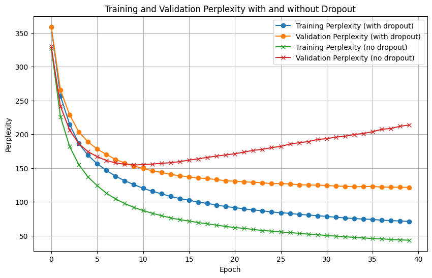
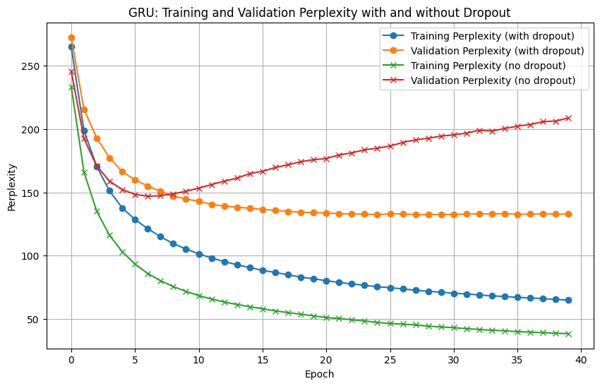

# Perplexity_Comparasion_RNN
This repository includes an implementation and replication of the "Recurrent Neural Network Regularization" paper by Zaremba et al. (2014). The models are trained and evaluated using the Penn Tree Bank (PTB) dataset. The implemented models are LSTM and GRU, both with and without dropout.


# RNN Regularization by Zaremba et al. (2014)

This repository includes an implementation and replication of the "Recurrent Neural Network Regularization" paper by Zaremba et al. (2014). The models are trained and evaluated using the Penn Tree Bank (PTB) dataset.

This project was completed as part of the homework for the Deep Learning course (0510725502) at Tel Aviv University.

The implemented models are LSTM and GRU, both with and without dropout.

## Table of Contents
- [Overview](#Overview)
- [Features](#Features)
- [Installation](#Installation)
- [Training](#training)
- [Evaluation](#evaluation)
- [Results](#results)

## Overview
The codes evaluates performance on language modeling tasks when introducing dropout regularization for Recurrent Neural Networks (RNNs), particularly Long Short-Term Memory networks (LSTMs) and Gated Recurrent Unit (GRUs).
We measure the performance by perplexity, 

## Features
This project includes the following features:
- Loading and exploring the Penn Tree Bank dataset.
- Splitting the dataset into training and test sets.
- Defining RNN models, with and without regularization.
- Training and assessing the model based on perplexity.

## Installation
```bash
pip install -r requirements.txt
```

## Training

Data

Ensure that your train_x, train_y, val_x, and val_y data are:
- Properly tokenized sequences, where each token corresponds to an index in the vocabulary.
- Split into inputs (train_x, val_x) and labels (train_y, val_y), where each label corresponds to the target token for the next word in the sequence.
- Numpy arrays or tensors with the correct length and format.

model initialization

```python
from Perplexity_Comparasion_RNN.HW2_utils import hw2LSTM

# Use or change the following hyperparameters:
hidden_dim = 200
embedding_dim = 512
batch_size = 20
dropout_p = 0.3  # (if used)
learning_rate = 1
clip = 3
print_every = 300
n_layers = 2
n_epoches = 40
seq_length = 35
vocab_size = len(vocabulary)  # Vocabulary size, 10002 in the case of PTB
embedding_dim = 200  # Embedding dimension
dropout_p = 0.5  # Dropout probability
device = torch.device("cuda" if torch.cuda.is_available() else "cpu")

model = hw2LSTM(
  batch_size=batch_size,
  seq_length=seq_length,
  hidden_dim=hidden_dim,
  n_layers=n_layers,
  vocab_size=vocab_size,
  embedding_dim=embedding_dim,
  dropout_p=dropout_p,
  device=device,
  rnn_type="LSTM",  # or "GRU"
  checkpoint=None  # Provide a checkpoint path if resuming training
)

```

Train the model:

```python
# Train the model
model_name = "desired_name"  # Model name for saving checkpoints

train_losses, val_losses, train_perplexities, val_perplexities =  HW2_utils.train(
    model=model,
    train_x=train_x,
    train_y=train_y,
    val_x=val_x,
    val_y=val_y,
    batch_size=batch_size,
    learning_rate=learning_rate,
    n_epoches=n_epoches,
    clip=clip,
    validate_and_print_every=validate_and_print_every,
    model_name=model_name
)
```

## Evaluation
Select your desired model. Choose the appropriate model checkpoint path and load the model. For example, to load an LSTM with dropout:

```python
checkpoint_path = "Perplexity_Comparasion_RNN/models/checkpoints/LSTM_dropout_0.3/best_validation_model.pt"
model = hw2LSTM(batch_size, seq_length, hidden_dim, n_layers, vocab_size, embedding_dim, dropout_p, device, rnn_type="LSTM", checkpoint=checkpoint_path)
model.eval()  # Set the model to evaluation mode
```
You can replace checkpoint_path with other options based on the model you want to evaluate, note that you update rnn_type argument accordingly:

GRU with dropout: "models/checkpoints/GRU_dropout_0.3/best_validation_model.pt" 

GRU without dropout: "models/checkpoints/GRU_no_dropout/best_validation_model.pt"

LSTM without dropout: "models/checkpoints/LSTM_no_dropout/best_validation_model.pt"

Set Up Parameters for Evaluation
```python
hidden_dim = 200
embedding_dim = 512
batch_size = 20
dropout_p = 0.3
learning_rate = 1
clip = 3
print_every = 300
vocab_size = 10000
print(vocab_size)
n_layers = 2
n_epoches = 40
seq_length = 35
```

Ensure your input sequence x is preprocessed and tokenized to match the format used during training

Run the model on the input sequence and retrieve the output:
```python
checkpoint_paths = {
    "LSTM_dropout_0.3": "models/checkpoints/LSTM_dropout_0.3/best_validation_model.pt",
    "LSTM_no_dropout": "models/checkpoints/LSTM_no_dropout/best_validation_model.pt",  
    "GRU_dropout_0.3": "models/checkpoints/GRU_dropout_0.3/best_validation_model.pt",   
    "GRU_no_dropout": "models/checkpoints/GRU_no_dropout/best_validation_model.pt"     
}

# Assuming hw2LSTM, batch_size, seq_length, hidden_dim, n_layers, vocab_size, embedding_dim, dropout_p, and device are defined

device = torch.device("cuda" if torch.cuda.is_available() else "cpu")

for model_name, checkpoint_path in checkpoint_paths.items():
    print(f"Evaluating model: {model_name}")
    try:
        if "LSTM" in model_name:
          rnn_type = "LSTM"
          dropout_p = 0.3 if "dropout" in model_name else 0
        else: #GRU
          rnn_type = "GRU"
          dropout_p = 0.3 if "dropout" in model_name else 0
        model = hw2LSTM(batch_size, seq_length, hidden_dim, n_layers, vocab_size, embedding_dim, dropout_p, device, rnn_type=rnn_type, checkpoint=checkpoint_path)
        model.eval()  # Set the model to evaluation mode

        perplexity = evaluate(encoded_test, test_labels, model, batch_size, device)
        print(f"Perplexity of {model_name}: {perplexity}")
        print("Evaluation complete.")

    except FileNotFoundError:
        print(f"Error: Checkpoint file not found for {model_name} at {checkpoint_path}")
    except Exception as e:
        print(f"An error occurred during evaluation of {model_name}: {e}")

```

## Results

All results were performed with the following hyperparameters:
```python
hidden_dim = 200
embedding_dim = 512
batch_size = 20
dropout_p = 0.3 # (if used)
learning_rate = 1
clip = 3
print_every = 300
vocab_size = len(vocabulary)  # Vocabulary size, 10002 in the case of PTB
n_layers = 2
n_epoches = 40
seq_length = 35

optimizer = optim.SGD(model.parameters(), lr=learning_rate)
def lr_lambda(epoch):
    if epoch <= 6:
        return 1.0  # No change for the first 6 epochs
    else:
        return (1.0 / (1.5 ** (epoch - 6)))  # Decrease by factor of 1.5 per epoch after epoch 6

# Use LambdaLR
scheduler = LambdaLR(optimizer, lr_lambda)
```

### LSTM 
The graph compares the training and validation perplexities of an LSTM model with and without dropout over 40 epochs.

No Dropout:

The model without dropout converged faster but exhibited a large gap between training and validation perplexities. This significant divergence indicates overfitting, where the model captures patterns specific to the training data but fails to generalize to unseen data.
The validation perplexity began increasing after a few epochs, signaling that the model started memorizing the training data instead of learning generalizable features.

With Dropout:

The LSTM model with dropout converged more slowly but achieved lower perplexity on both training and validation data. The gap between training and validation perplexities is smaller, demonstrating better generalization.
Dropout, by randomly deactivating neurons during training, prevented the network from relying too heavily on specific pathways. This regularization improved the model’s ability to learn robust and generalizable patterns.

Key Observations:

Models with dropout required more epochs to stabilize but yielded superior results overall.
The validation perplexity of the dropout model decreased steadily, contrasting with the upward trend seen without dropout.
The training curves suggest that with dropout, the model effectively avoided overfitting and maintained generalization even with increased training.

The training was capped at 40 epochs, and the LSTM model with dropout had not fully plateaued, suggesting potential for further improvements with additional training time.


### GRU without dropout

The graph shows the training and validation perplexities for a GRU model with and without dropout, similar to the LSTM comparison.

No Dropout:

As with the LSTM, the GRU model without dropout quickly overfit the training data, evident from the large gap between training and validation perplexities. The validation perplexity increased after ~5 epochs, reflecting poor generalization.

With Dropout:

Dropout again improved generalization, as seen in the closer alignment of training and validation perplexities. While convergence was slower, the model achieved better overall performance with lower perplexities.

Key Differences:

GRU without dropout had slightly faster initial convergence than LSTM but suffered from sharper overfitting.
GRU with dropout performed similarly to LSTM with dropout, with validation perplexities stabilizing over time and maintaining a smaller gap with training perplexities.




### Comparison

| Model                       | Train Perplexity | Validation Perplexity |  Test Perplexity |
|-----------------------------|----------------|--------------|--------------|
| LSTM without Dropout              | 43.2         | 154.7       | 149.21  |
| LSTM with Dropout         | 71.07      | 121.4       | 117.43 |
| GRU without Dropout | 38.48    | 146.9      |  142.10 |
| GRU with Dropout    | 64.92        | 132.3       | 127.32 |  

## References
- **Recurrent Neural Network Regularization by Zaremba et al. (2014)**:
  - Paper link: [Recurrent Neural Network Regularization (arxiv.org)](https://arxiv.org/abs/1409.2329)
  - Github: [wojzaremba/lstm](https://github.com/wojzaremba/lstm/tree/master)


